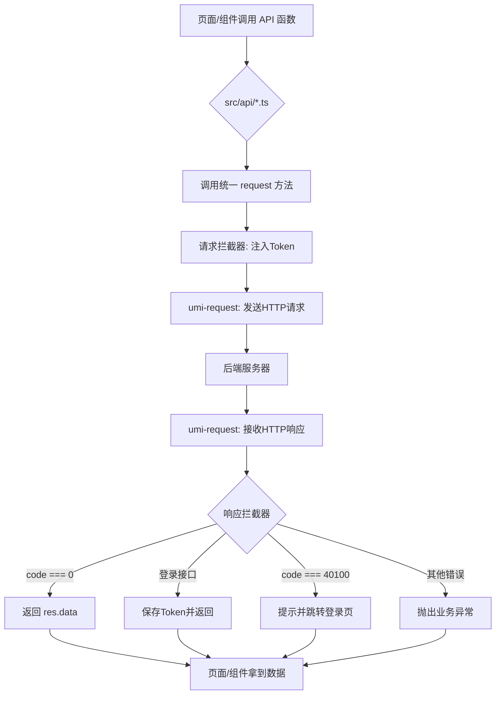

# 健身房管理系统 - 前端

本仓库是健身房管理系统的前端部分，基于 Ant Design Pro v6、UmiJS 4 和 React 18 构建。项目在 Ant Design Pro 的基础上，创新性地整合了 Tailwind CSS 和 shadcn/ui，旨在打造一个现代化、高效率、易于维护的企业级中后台应用。

## ✨ 技术栈 (Technology Stack)

-   **框架**: [UmiJS 4](https://umijs.org/) & [Ant Design Pro V6](https://pro.ant.design/)
-   **核心库**: [React 18](https://reactjs.org/)
-   **UI & 样式**:
    -   [Ant Design 5](https://ant.design/) & [@ant-design/pro-components](https://procomponents.ant.design/)
    -   [Tailwind CSS](https://tailwindcss.com/)
    -   [shadcn/ui](https://ui.shadcn.com/)
-   **API & 状态管理**:
    -   [umi-request](https://github.com/umijs/umi-request) (基于 Fetch 的封装)
    -   OpenAPI 自动生成 API 代码
-   **语言**: [TypeScript](https://www.typescriptlang.org/)

## 🚀 核心特性 (Core Features)

-   **混合 UI 策略**: 结合了 Ant Design 强大的开箱即用组件、Tailwind CSS 的原子化 CSS 快速构建能力以及 shadcn/ui 的优雅设计，提供了灵活而强大的 UI 构建体验。
-   **自动化 API 层**: `src/api` 目录下的所有请求代码均通过 OpenAPI 规范自动生成，开发者无需手动编写 API 调用代码，极大提升了与后端协作的效率。
-   **统一请求处理**: 在 `src/utils/request.ts` 中通过拦截器实现了全局的请求与响应处理。自动为请求注入认证 `Token`，并对响应进行统一的数据结构解析和错误处理（如未登录自动跳转）。
-   **环境分离**: 通过 `config/proxy.ts` 和环境变量，轻松实现开发、测试和生产环境的 API 地址分离与代理。
-   **配置化路由**: 在 `config/routes.ts` 中集中管理项目的所有路由，结构清晰，易于维护。

## 📁 项目结构 (Project Structure)

```
├── config/                # UmiJS 配置文件
│   ├── config.ts          # 核心配置
│   ├── proxy.ts           # 代理配置
│   └── routes.ts          # 路由配置
├── public/                # 静态资源
├── src/                   # 源码目录
│   ├── api/               # 自动生成的 API 服务
│   ├── components/        # 自定义业务组件 (推荐使用 shadcn/ui 风格)
│   ├── utils/             # 工具函数，包含 request 封装
│   ├── pages/             # 页面组件
│   └── app.tsx            # Umi 全局运行时配置
├── package.json           # 项目依赖
└── tailwind.css           # Tailwind CSS 入口文件
```

## 本地开发 (Local Development)

1.  **环境准备**: 确保你的开发环境已经安装了 Node.js >=16.0.0。

2.  **安装依赖**:
    ```bash
    npm install
    ```

3.  **启动项目**:
    此命令会同时启动 Tailwind CSS 的实时编译和 UmiJS 的开发服务器。
    ```bash
    npm run start:dev
    ```

4.  **构建项目**:
    ```bash
    npm run build
    ```

5.  **代码风格检查**:
    ```bash
    npm run lint
    ```

## 🌐 API 请求流程 (API Request Flow)

下面是项目中一个完整的 API 请求所经历的流程图：



